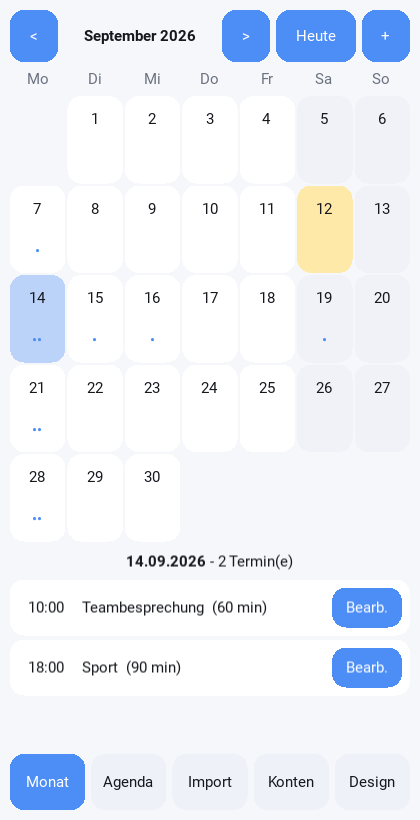
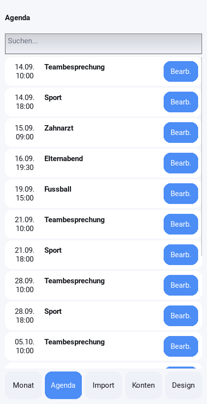
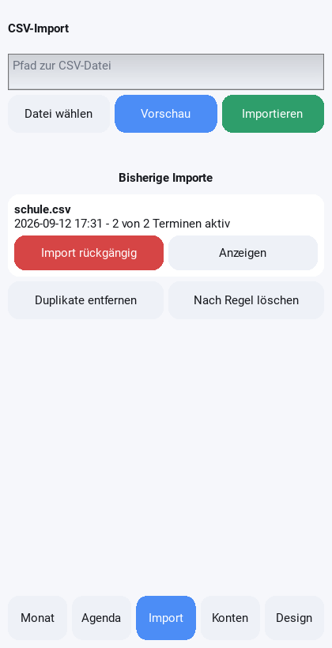
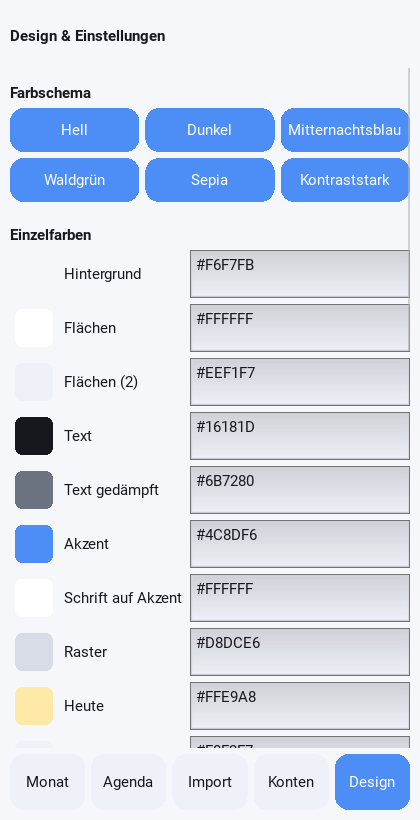

# PyCalendar

Eine Kalender-App für Android, vollständig in **Python 3** geschrieben
(Kivy + Buildozer). Sie synchronisiert mit Google Kalender, Outlook und
beliebigen CalDAV-Servern, **lernt die typische Dauer wiederkehrender
Ereignisse**, macht CSV-Importe mit einem Fingertipp rückgängig und lässt
Farben und Hintergrund frei konfigurieren.

| Monatsansicht | Agenda | CSV-Import | Design |
|---|---|---|---|
|  |  |  |  |

## Die vier Kernanforderungen

| Anforderung | Umsetzung | Wo |
|---|---|---|
| Synchronisierung mit Google/Outlook | CalDAV (zwei Wege) + ICS-Abo (lesend), Konfliktauflösung mit Sicherungskopie | `pycal/sync/` |
| Muster bei wiederkehrenden Ereignissen (Dauer pro Ereignisname) | Median-Statistik pro normalisiertem Titel, dazu Startzeit, Wochentage, Ort; erkennt auch den Rhythmus (RRULE-Vorschlag) | `pycal/patterns.py` |
| Löschen importierter CSV-Einträge muss leicht sein | Jeder Import ist ein Stapel mit eigener ID → ein Knopf „Import rückgängig", zusätzlich Einzellöschung, Regel-Löschung und Duplikatbereinigung | `pycal/csvio.py` |
| Hintergrund und Farben konfigurierbar | 12 Einzelfarben, 6 Vorlagen, Volltonfarbe/Verlauf/Bild, Deckkraft, Eckenrundung, Schriftgröße, Kontrastwarnung | `pycal/theme.py` |

## Schnellstart (Desktop, zum Ausprobieren)

```bash
pip install -r requirements.txt
python3 main.py                     # grafische App
python3 main.py --selftest          # Logik ohne Oberfläche prüfen
python3 main.py --import termine.csv
python3 main.py --undo 1            # genau diesen Import wieder entfernen
python3 main.py --sync
```

## APK bauen

**Ohne eigenes Android-SDK (empfohlen):** Das Projekt zu GitHub hochladen,
dann *Actions → „APK bauen" → Run workflow*. GitHub baut die Datei und stellt
sie unter „Artifacts" zum Herunterladen bereit. Der Ablauf steht in
`.github/workflows/build-apk.yml` und prüft vorher die komplette Testsuite.

**Lokal (Linux oder WSL):**

```bash
pip install buildozer cython
buildozer -v android debug          # erzeugt bin/pycalendar-1.0.0-debug.apk
buildozer android deploy run logcat # auf ein angeschlossenes Gerät
```

Details und Stolpersteine: [docs/ENTWICKLUNG.md](docs/ENTWICKLUNG.md).

## Tests

```bash
python3 -m pytest tests -q          # 152 Tests, davon 69 Sicherheits-Testfunktionen
```

* `tests/test_models.py` – Wiederholungsregeln, Zeitlogik
* `tests/test_patterns.py` – Mustererkennung (Dauer pro Ereignisname)
* `tests/test_csvio.py` – Import, Duplikate, Rückgängigmachen
* `tests/test_sync.py` – iCalendar, Sync-Logik
* `tests/test_security.py` – Sicherheitsbausteine einzeln
* `tests/test_pentest.py` – **simulierte Angriffe** gegen die fertige App

## Sicherheit

Die App wurde einem eigenen Penetrationstest unterzogen; drei echte Mängel
wurden dabei gefunden und behoben. Vollständiger Bericht:
[docs/PENTEST.md](docs/PENTEST.md), Sicherheitskonzept:
[docs/SICHERHEIT.md](docs/SICHERHEIT.md).

## Weitere Dokumentation

* [Benutzerhandbuch](docs/BENUTZERHANDBUCH.md) – Bedienung Schritt für Schritt
* [Architektur](docs/ARCHITEKTUR.md) – Aufbau, Datenmodell, Abläufe
* [Sicherheitskonzept](docs/SICHERHEIT.md)
* [Penetrationstest-Bericht](docs/PENTEST.md)
* [Entwicklung & Build](docs/ENTWICKLUNG.md)

## Lizenz

MIT – siehe `LICENSE`.
